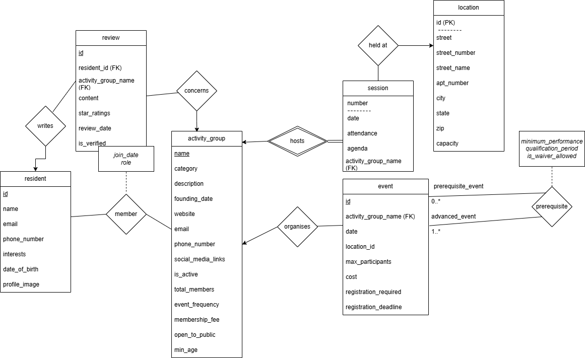

# Connecting Boston: Local Activity Group Web App

## Overview

This project delivers a lightweight, real-world web application that helps Boston residents find and participate in local activity groups. It solves the problem of scattered or inaccessible group listings by offering a centralized, intuitive platform where users can join activities, register for events, and leave feedback.

Organizers benefit from tools that help them manage sessions, track membership, and gather insights from reviews. The backend is built in Flask with a normalized SQLite database and a user-friendly HTML/CSS/Jinja2 frontend.

Key capabilities:
- Discover and filter groups by interest, cost, frequency, and age group
- Register for events and track participation
- Leave reviews (feature in progress)
- Enable organizers to manage groups, schedule events, and oversee engagement

---

## Recent Feature Additions

The application now includes several important updates:

- Admin dashboard for managing events and overseeing platform activity
- User profiles for personal information and participation tracking
- Prerequisite event tracking for advanced scheduling logic
- Waitlist system with automatic notifications for full events
- Full event registration functionality within the platform
- Distinct user and admin views based on role permissions
- Notification system for registration status and waitlist movement

These enhancements improve both user experience and administrative efficiency.

---

## Team Members and Roles

- Jin Yang Chen – Development Engineer
- Omer Yurekli – Backend Testing & Development Engineer
- Salamun Nuhin – Testing & Development Engineer
- Omar Tall – General Developer
- Arona Gaye – General Developer
- Abraham Chang – Documentation

---

## Quick Start: Deployment Instructions

1. Clone the Repository
```bash
git clone https://github.com/databases-CSCI3354/project1-online-commerce.git
cd project1-online-commerce/P3
```

2. Create and Activate a Python Virtual Environment
```bash
python3 -m venv .venv
source .venv/bin/activate  # for Linux/macOS
```

3. Install Dependencies
```bash
pip install -r requirements.txt
```

4. Set Up Environment Variables
```bash
cp .env.example .env
```
5. Run the seed data
```bash
python seed.py
```

5. Run the Application
```bash
flask run
```

---

## Testing

The application uses `pytest` for unit and integration testing.

To run all tests:
```bash
python -m pytest
```

For linting:
```bash
make lint
```

Test directory structure:
```
tests/
├── routes/
├── services/
├── integration_test.py
└── conftest.py
```

---

## E-R Diagram and Schema Summary

The E-R diagram below shows how users, events, groups, and registrations are related.



### Key Entities and Attributes
- Users: id (PK), username, email, hashed_password
- Groups: id (PK), name, description, category, cost
- Events: id (PK), group_id (FK), title, date, location
- Registrations: id (PK), user_id (FK), event_id (FK), status
- Reviews (in development): id (PK), user_id (FK), group_id (FK), star_rating, comment
- Prerequisites: id (PK), event_id (FK), prerequisite_event_id (FK), minimum_performance, qualification_period, is_waiver_allowed, created_at 

### Updated Entities and Attributes Not in ER Diagram
- Waitlist: id (PK), event_id (FK), user_id (FK), created_at

## 📘 Entity Relationships from Schema

### Resident ↔ Review
- **Type**: One-to-Many
- **Explanation**: One resident can write many reviews, but each review is written by only one resident.

### Resident ↔ Member (ActivityGroup)
- **Type**: Many-to-Many
- **Explanation**: Residents can be members of multiple groups, and each group can have multiple residents.
- **Implemented via**: `member(resident_id, activity_group_name)`

### Resident ↔ Registrations
- **Type**: One-to-Many
- **Explanation**: One resident can register for many events. Each registration belongs to one resident.

### Resident ↔ Waitlist
- **Type**: One-to-Many
- **Explanation**: One resident can be waitlisted for many events, and each waitlist entry is tied to one resident.

### Resident ↔ Event (created_by)
- **Type**: One-to-Many
- **Explanation**: A resident can create multiple events; each event has one creator (`created_by` foreign key).

---

### ActivityGroup ↔ Review
- **Type**: One-to-Many
- **Explanation**: One group can have many reviews, but each review belongs to one group.

### ActivityGroup ↔ Event
- **Type**: One-to-Many
- **Explanation**: A group can host many events. Each event belongs to a single group.

### ActivityGroup ↔ Session
- **Type**: One-to-Many
- **Explanation**: A group can have many sessions; each session is hosted by one group.

### ActivityGroup ↔ Member (Resident)
- **Type**: Many-to-Many
- **Explanation**: Same as above. Many groups have many members, via the `member` table.

---

### Event ↔ Location
- **Type**: Many-to-One
- **Explanation**: Many events can take place at the same location. Each event has one location.

### Event ↔ Session
- **Type**: One-to-Many
- **Explanation**: Each event can have multiple sessions associated with it.

### Event ↔ Registrations
- **Type**: One-to-Many
- **Explanation**: One event can have many registration records.

### Event ↔ Waitlist
- **Type**: One-to-Many
- **Explanation**: One event can have many users on the waitlist.

### Event ↔ Prerequisite
- **Type**: Many-to-Many (self-referencing)
- **Explanation**: One event can have multiple prerequisites and be a prerequisite for others.
- **Implemented via**: `prerequisite(event_id, prerequisite_event_id)`


### Design Considerations
- Users may join multiple groups
- Events may have prerequisites
- Secure and restricted access controls
- Updates handled through a form-based UI

---

## Features

- Secure user login and password encryption
- Clean separation of logic with MVC structure
- Form validation and responsive feedback messages
- Role-based access controls
- Notification system for users
- Automated testing and linting

---

## Known Limitations

- Partial session management implementation
- Prerequisite management for users manually

---

## Lessons Learned

- Early ER design decisions reduce future complexity
- Proper use of development tools improves project quality
- Separation of concerns in routes and services aids scalability
- Naming conventions for tables need further improvements
- Maybe just use cookies instead of creating sessions

---

## Presentation Materials

The full project slide deck is available in the repo as a pdf file. It includes:
- Problem background
- E-R diagram
- Schema breakdown
- Application flow
- Demo examples
